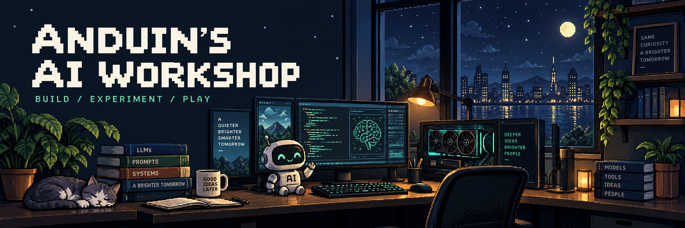

<p align="center">
  <b>Hi, I'm Anduin.</b><br>
  Exploring AI. Automating the tedious. Building for the fun of it.<br>
  <sub>研究一点 AI，少做一点重复劳动，多造一点好玩的东西。</sub>
</p>

<p align="center">
  <a href="mailto:anduin9527@gmail.com">Say hello ↗</a>
  &nbsp; · &nbsp;
  <a href="https://github.com/Anduin9527?tab=repositories">Explore the workshop ↗</a>
</p>

---

### A little about me

```yaml
anduin:
  curious_about: [AI, agents, computer vision]
  enjoys: [automation, open source, small experiments]
  toolkit: [Python, PyTorch, C++, Linux]
  approach: "Have an idea? Build a tiny version."
```

### Little steps, over time

<picture>
  <source media="(prefers-color-scheme: dark)" srcset="https://raw.githubusercontent.com/Anduin9527/Anduin9527/main/assets/contributions-dark.svg">
  <source media="(prefers-color-scheme: light)" srcset="https://raw.githubusercontent.com/Anduin9527/Anduin9527/main/assets/contributions.svg">
  
</picture>

<p align="center"><sub>A small trail of things tried, fixed, and learned. Updated daily.</sub></p>
